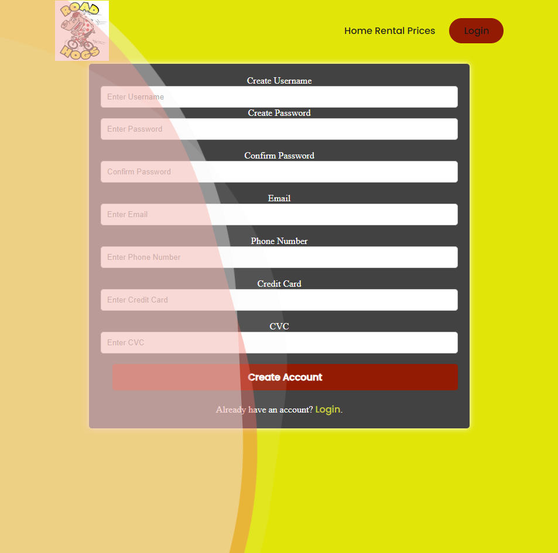

# bike-rentals

## Description

This is a webpage for a bike and scooter rental service. Various vehicles are available to rent for a day, so that our customers can enjoy the sights of the city while still having fast, green transport. The interface is clean and intuitive so that we quickly and easily provide our services.

## Table of Contents

- [Installation](#installation)
- [Usage](#usage)
- [Visual](#visual)
- [URLs](#urls)
- [Credits](#credits)
- [License](#license)

## Installation

Clone the repository from GitHub and open it with any source editor. Make sure to type "npm install" into the terminal before launching the server to ensure that all required packages are present and up to date.

## Usage

When you visit the homepage, you will be greeted with an enter button in the center, or options in the navigation bar at the top. It is recommended that users login or sign up using the login button in the top right before continuing. If a user is alread logged in, then the enter button will take them to the rental page.

The login page is simply a form asking for a username and password. If the username and password match an account from the database, then the user will be logged in. For users without an account, there is a sign up link at the bottom of the page.

The sign in page is a longer form with extra required information, such as email, phone, and credit card numbers. The email is a unique attribute so each email can only have one account. The phone number is stored in case we, as a fake company, would ever need to contact a customer. The credit card information is stored and encrypted in the database for the future when a customer wishes to rent a bike or a scooter from us.

Up signing up, the user is automatically logged in an brought back to the home page.

The rentals page has a list of all vehicles that are available for rent. When a customer clicks on the "Rent Now!" button on a vehicle card, they are brought to the specific rental page for that vehicle.

## Visual

Home Page on arrival

Login Page

Sign Up Page

## URLs

GitHub Repository: https://github.com/Shippo704/bike-rentals

Heroku Link: https://road-hog-rentals-84a0fa5f26f5.herokuapp.com/

## Credits

Contributors:

Hung Quoc Dang

Adam Warren

Matthew Taylor

## License

MIT License

Copyright (c) 2023

Permission is hereby granted, free of charge, to any person obtaining a copy
of this software and associated documentation files (the "Software"), to deal
in the Software without restriction, including without limitation the rights
to use, copy, modify, merge, publish, distribute, sublicense, and/or sell
copies of the Software, and to permit persons to whom the Software is
furnished to do so, subject to the following conditions:

The above copyright notice and this permission notice shall be included in all
copies or substantial portions of the Software.

THE SOFTWARE IS PROVIDED "AS IS", WITHOUT WARRANTY OF ANY KIND, EXPRESS OR
IMPLIED, INCLUDING BUT NOT LIMITED TO THE WARRANTIES OF MERCHANTABILITY,
FITNESS FOR A PARTICULAR PURPOSE AND NONINFRINGEMENT. IN NO EVENT SHALL THE
AUTHORS OR COPYRIGHT HOLDERS BE LIABLE FOR ANY CLAIM, DAMAGES OR OTHER
LIABILITY, WHETHER IN AN ACTION OF CONTRACT, TORT OR OTHERWISE, ARISING FROM,
OUT OF OR IN CONNECTION WITH THE SOFTWARE OR THE USE OR OTHER DEALINGS IN THE
SOFTWARE.